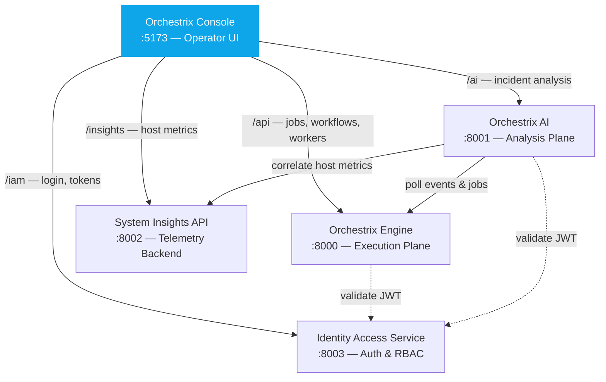

# Orchestrix Console

**The single entry point for the [Orchestrix Platform](#platform-architecture).** Consumes data from all four backend services — jobs & workflows from Engine, incident analysis from AI, host metrics from Insights, auth from IAM. Emits operator actions (retry, cancel, investigate) back through each service API.

Real-time operations console for orchestrating async workflows, analyzing system telemetry, and debugging incidents across distributed systems.

---

## Part of the Orchestrix Platform

Orchestrix Console is the **control plane / operator UI** of the Orchestrix Platform — the single entry point for managing workflows, investigating incidents, and monitoring system health.

| Service | Role | Interaction |
|---------|------|-------------|
| **[Orchestrix Engine](https://github.com/Yogevso/Orchestrix-Engine)** | Execution plane | Console calls Engine REST API + WebSocket for job/workflow management and live updates |
| **[Orchestrix AI](https://github.com/Yogevso/orchestrix-ai)** | Analysis plane | Console sends incidents to AI and displays root-cause analysis, reasoning, and recommendations |
| **[System Insights API](https://github.com/Yogevso/system-insights-api)** | Telemetry backend | Console fetches host/service metrics and alerts for the telemetry dashboard |
| **[Identity Access Service](https://github.com/Yogevso/identity-access-service)** | Shared auth | Console authenticates via IAM login and passes JWT tokens to all platform APIs |

**Data Console consumes:**
- Jobs, workflows, workers, queue stats from Engine (`/api/*`)
- AI-powered incident analysis from Orchestrix AI (`/ai/*`)
- Host metrics, alerts, and timeline from System Insights API
- JWT tokens and user context from Identity Access Service

### Platform Architecture



---

## Why This Exists

Modern backend systems generate large volumes of jobs, events, and alerts — but debugging issues requires jumping between multiple tools.

Orchestrix Console provides a unified interface to:
- Monitor async workflows
- Analyze telemetry from system tools
- Investigate incidents with correlated data

It transforms backend infrastructure into a single, observable system.

## Key Highlights

- Real-time system observability across jobs, events, and alerts
- **AI-powered incident analysis** — one-click "Explain Incident" via [Orchestrix AI](https://github.com/Yogevso/orchestrix-ai)
- Incident debugging via correlated timelines (events + jobs + actions)
- Interactive analytics dashboards for operational insights
- Dark/light mode with system preference detection
- **9 design presets** — Midnight, Emerald, Rosé, Ocean, Amber, Monochrome, Cyberpunk, Nord, Dracula — each with unique border radius, sidebar style (solid/glass/bordered), font weight, and optional glow effects
- Live event streaming for real-time monitoring
- Command palette (`Ctrl+K`) for power-user navigation
- Keyboard-driven tables — `j`/`k` to navigate, `Enter` to open
- Sparkline activity charts per job row
- URL-synced filters (shareable filtered views)
- Time-range selector for observability-style filtering
- Toast notifications for action feedback
- Code-split routes for fast initial load

## Features

- **Authentication** — JWT-based login with auto-auth API interceptor and session persistence
- **Jobs Dashboard** — List, filter (status/type/source), retry, cancel, and inspect async jobs with pagination and sparkline activity charts
- **Events & Alerts** — Live event feed with severity coloring, real-time updates, time-range filtering, and multi-filter support
- **Analytics Dashboard** — Jobs over time, failure rate, events by severity with interactive Recharts visualizations
- **Audit Logs** — Track user and system actions with filtering by user/action
- **Incident Investigation** — Correlated timeline showing how events, jobs, alerts, and actions relate during an incident
- **AI Explain Incident** — Calls [Orchestrix AI](https://github.com/Yogevso/orchestrix-ai) (`POST /ai/analyze-incident`) to get root cause analysis, reasoning steps, correlations, recommended action, and quality scores — displayed in a slide-out panel
- **Command Palette** — `Ctrl+K` to quickly navigate between any page
- **Keyboard Navigation** — `j`/`k`/`Enter` for table navigation without touching the mouse
- **URL-Synced Filters** — Filter state persists in the URL, making filtered views shareable
- **Toast Notifications** — Contextual feedback for job retry/cancel and other actions
- **Design Presets** — 9 visually distinct themes with dark/light variants, unique border radii, sidebar styles, and glow effects
- **404 Page** — Friendly not-found page with navigation back to dashboard

## Incident View

The Incident View correlates system behavior into a unified investigation timeline:

- Chronological event timeline
- Linked jobs and retries
- Severity-based visualization
- Root-cause summary

```
CPU spike → anomaly detected → job created → job failed → retry → success
```

Each step is visualized and connected, enabling fast debugging of complex system behavior.

### AI-Powered Explanation

Click **"Explain Incident"** to call [Orchestrix AI](https://github.com/Yogevso/orchestrix-ai) — the response is displayed in a slide-out panel with:

- **Summary** — AI-generated incident overview
- **Root Cause** — identified origin of the failure
- **Recommended Action** — suggested remediation
- **Correlations** — cross-source signal patterns (e.g. deployment → error chain)
- **AI Timeline** — ordered events with severity and timestamps
- **Reasoning Steps** — transparent chain-of-thought trace
- **Quality Scores** — confidence, signal strength, and data coverage
- **Source Badge** — shows whether analysis came from AI (GPT-4o) or rule-based fallback

When Orchestrix AI is not running, a built-in mock fallback generates a contextual analysis from the incident data so the demo works standalone.

## Tech Stack

| Layer | Tech |
|-------|------|
| Framework | React 19 + TypeScript |
| Build | Vite 8 |
| Styling | Tailwind CSS v4 |
| Routing | React Router v7 |
| Data Fetching | TanStack React Query |
| HTTP Client | Axios |
| Charts | Recharts |
| Icons | Lucide React |

## Architecture

```
React App (Orchestrix Console)
       │
       ├── /api → Orchestrix Backend (localhost:8000)
       │            ├─ PostgreSQL (jobs, events, incidents)
       │            ├─ Redis + Celery (async workers)
       │            └─ WebSocket (live event stream)
       │
       └── /ai  → Orchestrix AI (localhost:8001)
                    ├─ Correlation Engine (deterministic)
                    ├─ RAG Retriever (keyword filtering)
                    └─ LLM Service (OpenAI GPT-4o + rule-based fallback)
```

The frontend proxies `/api` requests to the backend (`localhost:8000`) and `/ai` requests to [Orchestrix AI](https://github.com/Yogevso/orchestrix-ai) (`localhost:8001`). Mock data and fallback analysis are included for standalone demo.

## Getting Started

```bash
npm install
npm run dev
```

Open http://localhost:5173 and login with **admin / admin**.

### With AI Integration

To enable live AI-powered incident analysis, run [Orchestrix AI](https://github.com/Yogevso/orchestrix-ai) alongside:

```bash
# Terminal 1 — Console
npm run dev

# Terminal 2 — Orchestrix AI (port 8001)
cd ../orchestrix-ai
uvicorn app.main:app --reload --port 8001
```

The "Explain Incident" button will call the AI service automatically. Without it, the built-in mock fallback is used.

## Project Structure

```
src/
├── api/            # API client, mock data, endpoint functions
├── components/     # AppLayout, CommandPalette, DesignPicker, Sparkline, TimeRangeSelector, shared UI
├── config/         # Design presets and visual style definitions
├── hooks/          # Auth, theme, live events, keyboard nav, URL filters, page titles, toasts
├── pages/          # All page components
│   ├── Login.tsx
│   ├── Dashboard.tsx
│   ├── Jobs.tsx
│   ├── JobDetails.tsx
│   ├── Events.tsx
│   ├── Analytics.tsx
│   ├── AuditLogs.tsx
│   ├── IncidentView.tsx
│   └── NotFound.tsx
├── types/          # TypeScript interfaces
└── utils/          # Formatting, colors, helpers
```

## Design Principles

- Clear separation between data ingestion, processing, and visualization
- Consistent UI patterns across dashboards and views
- Real-time feedback for system state changes
- Focus on observability and debugging workflows
- Keyboard-first interactions for power users
- URL as source of truth for filter state

## License

MIT
